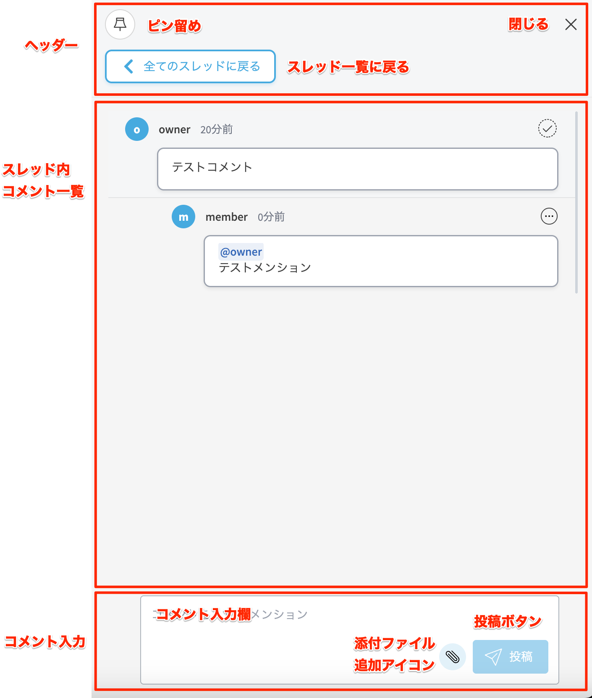
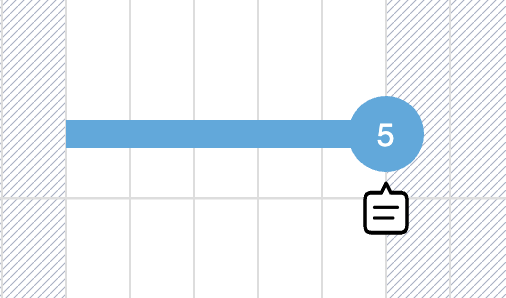
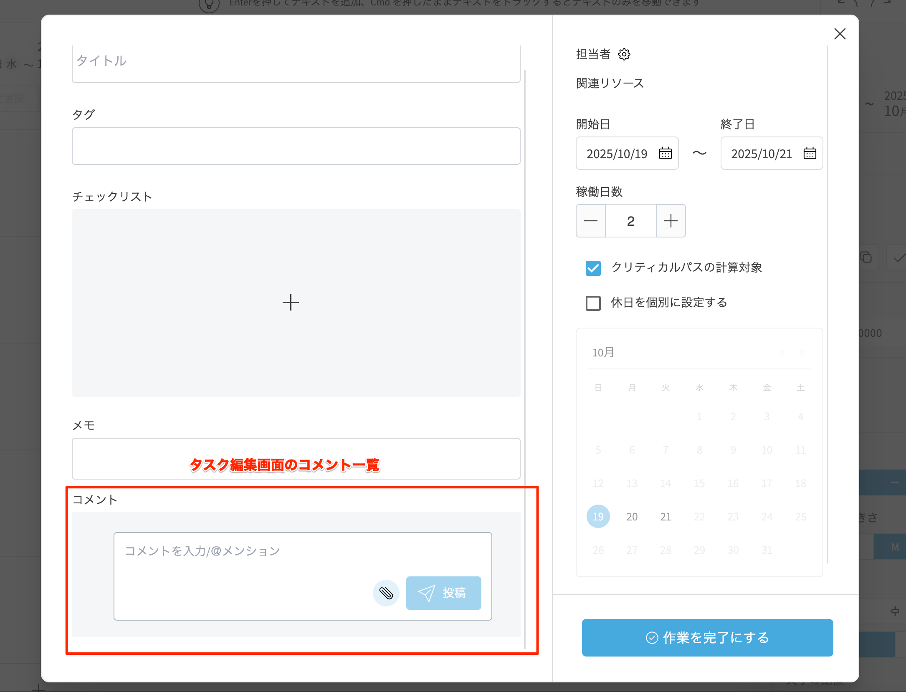
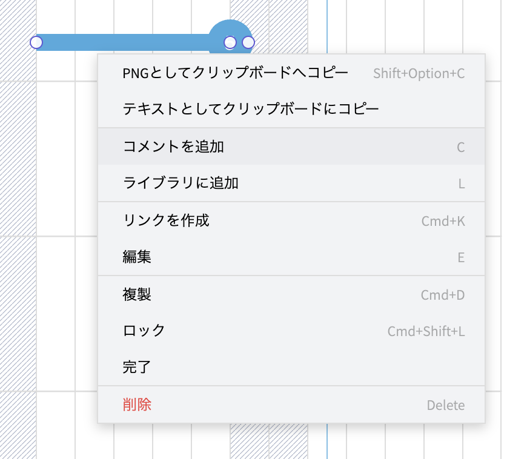
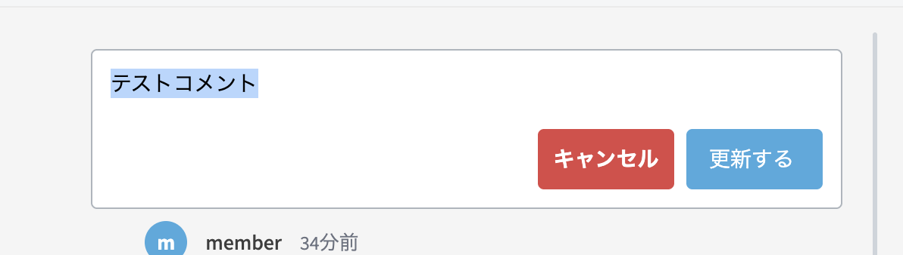
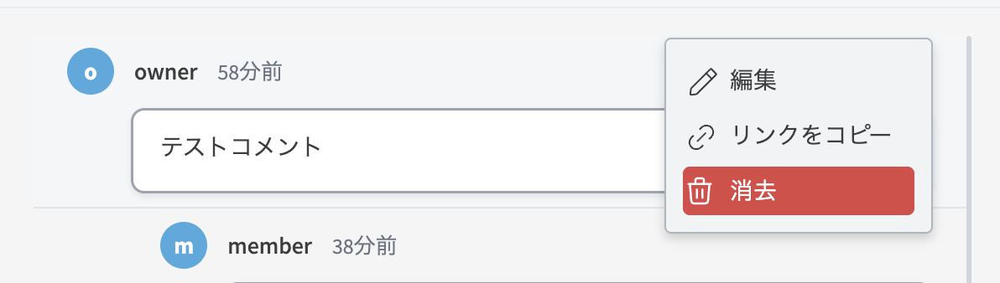
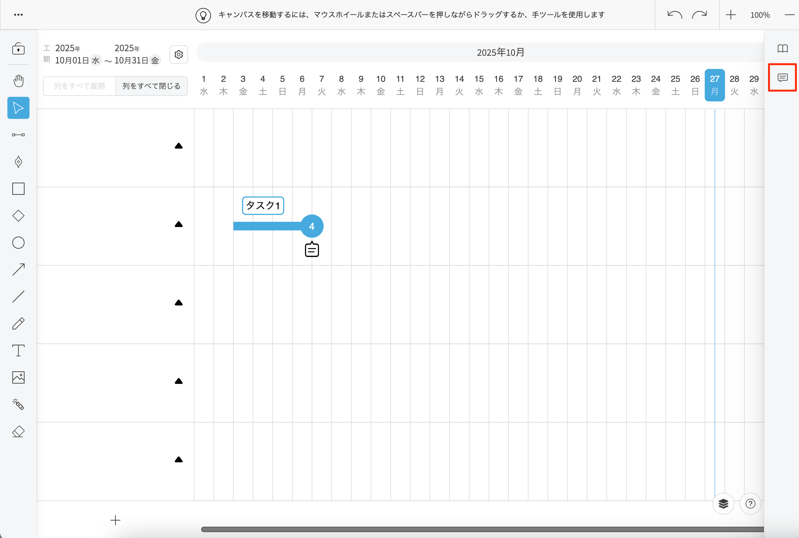
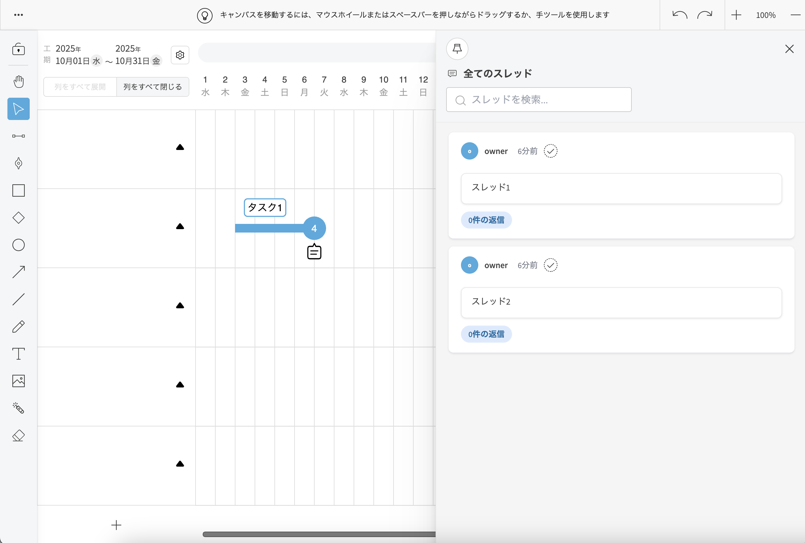

# コメントのやり取りをする
{: .no_toc }

  組織内のメンバーとコメントのやり取りをすることができます。

## 目次
{: .no_toc .text-delta }

1. TOC
{:toc}

---

## 各部の名称

   

   

   

   

## コメントの追加

### コンテキストメニュー

1. ツールバーの[選択]アイコンをクリックしてアクティブにします。

   

2. タスクを右クリック(iPad:タッチ&ホールド)でコンテキストメニューを開き、[コメント追加]を選択します。

   

3. コメント入力欄にコメントを入力またはファイルを添付し、[投稿]ボタンをクリックします。

   

   

### コメントアイコン

1. ツールバーの[選択]アイコンをクリックしてアクティブにします。

   

2. タスクの[コメント]アイコンをクリックします。

   

3. コメント入力欄にコメントを入力またはファイルを添付し、[投稿]ボタンをクリックします。

{: .note}
コメントアイコンはタスクに1件以上コメントがある場合のみ表示されます。

### タスク編集画面

1. ツールバーの[選択]アイコンをクリックしてアクティブにします。

   
    
2. 以下のいずれかの操作を行います。
    - サイドバーの操作から[編集]ボタンをクリックします。
    - タスク右上の[編集]アイコンをクリックします。
    - 右クリック(iPad:タッチ&ホールド)でコンテキストメニューを開き、[編集]を選択します。

3. コメント入力欄にコメントを入力またはファイルを添付し、[投稿]ボタンをクリックします。

   

{: .note}
@を入力するとプロジェクトにアサインしているメンバーにメンションを付けてコメントすることができます。
メンションされたユーザーにはメールで通知されます。

## コメントの編集

### コメントアイコン

1. ツールバーの[選択]アイコンをクリックしてアクティブにします。

   

2. タスクの[コメント]アイコンをクリックします。

   

3. コメントの[...]のドロップダウンメニューから[編集]ボタンをクリックします。

   

4. コメント入力欄にコメントを入力し、[更新する]ボタンをクリックします。

   

### タスク編集画面

1. ツールバーの[選択]アイコンをクリックしてアクティブにします。

   
  
2. 以下のいずれかの操作を行います。
    - サイドバーの操作から[編集]ボタンをクリックします。
    - タスク右上の[編集]アイコンをクリックします。
    - 右クリック(iPad:タッチ&ホールド)でコンテキストメニューを開き、[編集]を選択します。

3. コメントの[...]のドロップダウンメニューから[編集]ボタンをクリックします。

   

4. コメント入力欄にコメントを入力し、[更新する]ボタンをクリックします。

   

{: .note}
@を入力するとプロジェクトにアサインしているメンバーにメンションを付けてコメントすることができます。
メンションされたユーザーにはメールで通知されます。

## コメントの削除

### コメントアイコン

1. ツールバーの[選択]アイコンをクリックしてアクティブにします。

   

2. タスクの[コメント]アイコンをクリックします。

   

3. コメントの[...]のドロップダウンメニューから[削除]ボタンをクリックします。

   

### タスク編集画面

1. ツールバーの[選択]アイコンをクリックしてアクティブにします。

   
  
2. 以下のいずれかの操作を行います。
    - サイドバーの操作から[編集]ボタンをクリックします。
    - タスク右上の[編集]アイコンをクリックします。
    - 右クリック(iPad:タッチ&ホールド)でコンテキストメニューを開き、[編集]を選択します。

3. コメントの[...]のドロップダウンメニューから[削除]ボタンをクリックします。

   

## スレッド一覧の表示

サイドバーの[コメント]アイコンをクリックします。

サイドバーにスレッド一覧が表示されます。

スレッドをクリックすると、該当のコメントのあるタスクまでキャンバスがスクロールし、サイドバーにコメントが表示されます。  
[すべてのスレッドへ戻る]をクリックするとスレッド一覧に戻ります。

コメントのあるタスクが完了済みの場合、チェックマークにチェックが付きます。

