# ネットワーク線の作成・編集
{: .no_toc }

## 目次
{: .no_toc .text-delta }

1. TOC
{:toc}

---

## タスク・マイルストーンを依存関係にする

1. ツールバーの[選択]アイコンをクリックしてアクティブにします。

   

2. タスクをクリックして選択します。
3. タスク終点から出ているサークルをクリックします。

   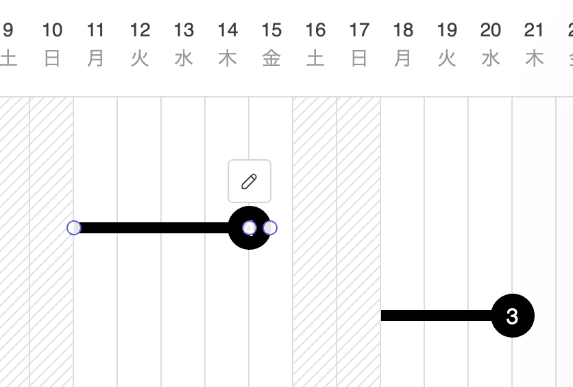
  
4. 依存対象にするタスクの始点/マイルストーンまでドラッグし、ホバーアニメーションが表示されている状態でドロップします。

   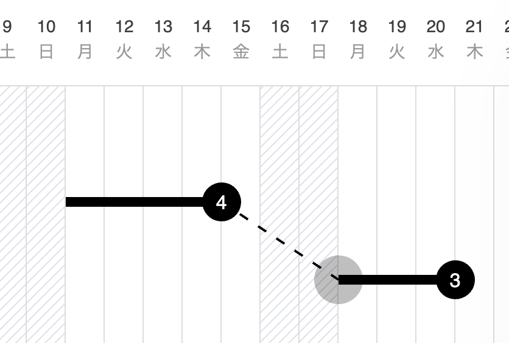

   クリティカルパス（キャンバス内で最も長い経路）に該当する場合、一連のタスクとネットワーク線が自動的に水色になります。

   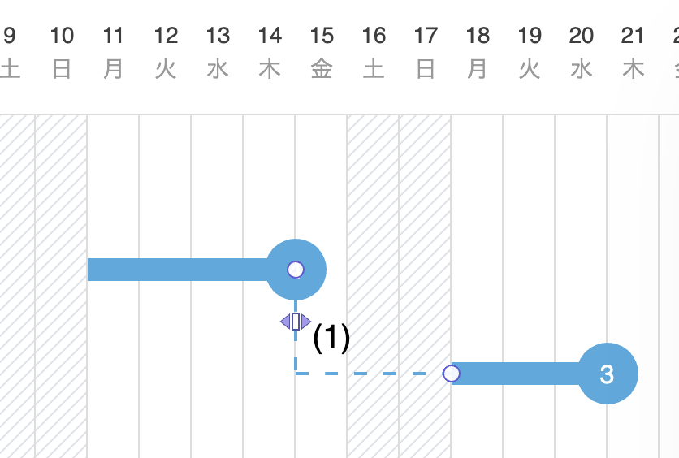

   既存のタスクの右側に隣接してタスクを作成すると自動的に依存関係になります。

   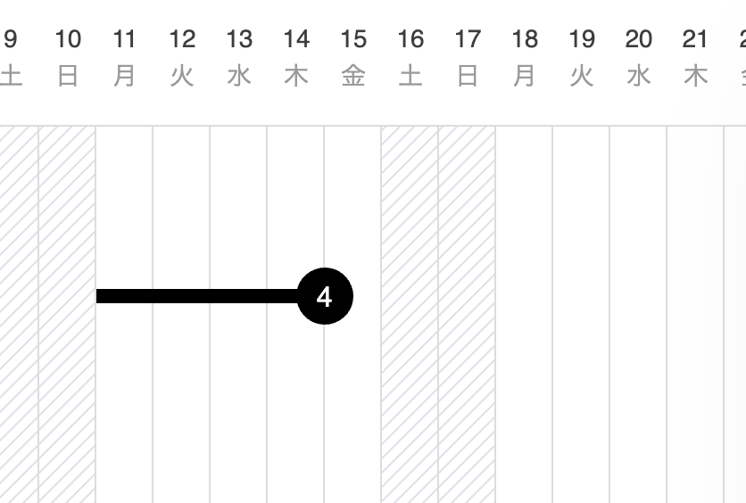

   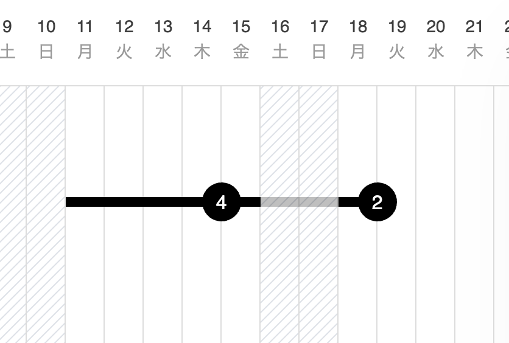

   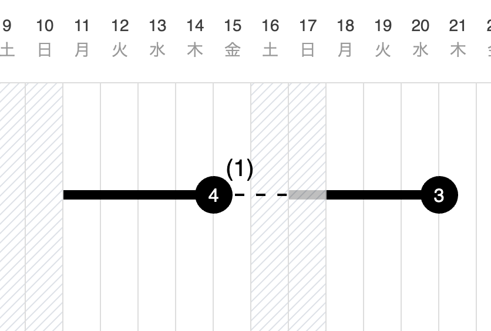

{: .warning }
依存関係の作成には次の制約があります。  
・始点からネットワーク線を作成することはできません  
・終点から日付を遡る点へネットワーク線を引くことはできません  
・期間が重なるタスクを前後で依存関係にすることはできません

## タスク・マイルストーンの依存対象を変更する

1. ツールバーの[選択]アイコンをクリックしてアクティブにします。

   

2. ネットワーク線をクリックして選択します。
3. ネットワーク線両端のいずれかのサークルをクリックします。

   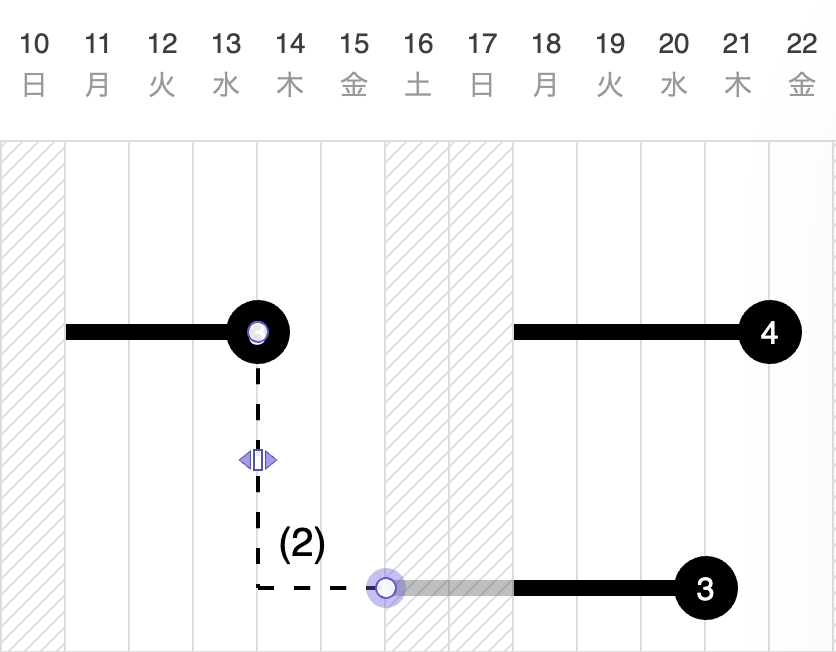
  
4. 変更先依存対象のタスク/マイルストーンまでドラッグし、ホバーアニメーションが表示されている状態でドロップします。

   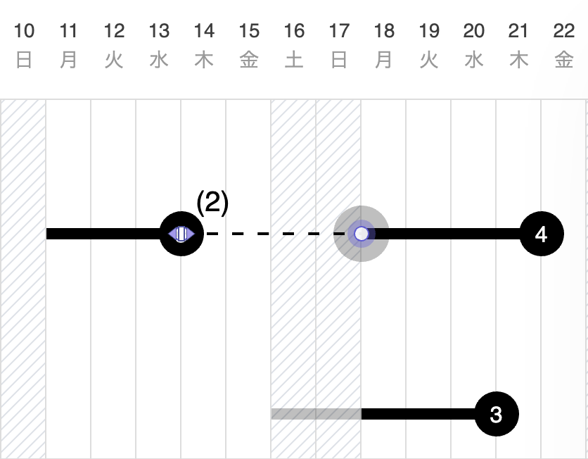
  
{: .warning }    
タスクの依存対象を変更するには次の制約があります。  
・始点/終点同士を結ぶことはできません  
・終点から日付を遡る点へネットワーク線を引くことはできません  
・期間が重なるタスクを前後で依存関係にすることはできません

## ネットワーク線の中間線を編集する

1. ツールバーの[選択]アイコンをクリックしてアクティブにします。

   

2. ネットワーク線をクリックして選択します。

   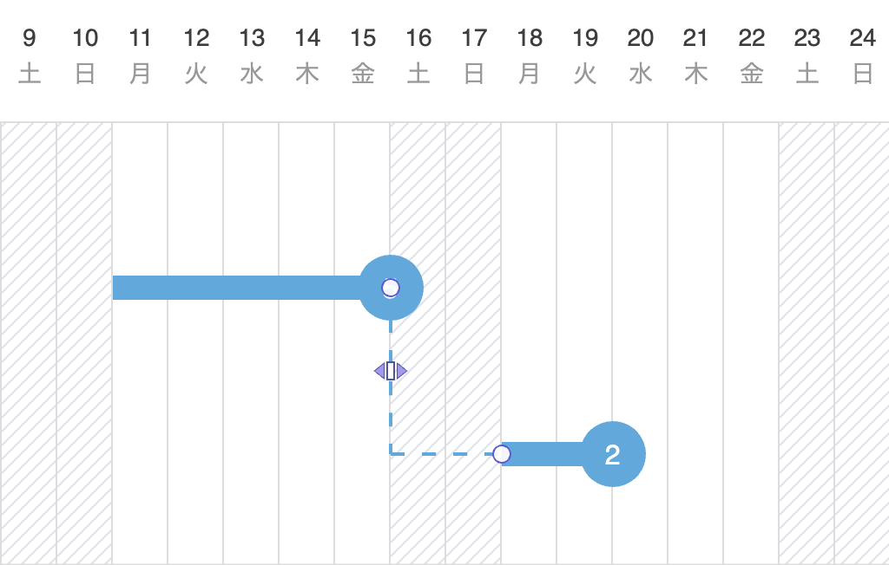

3. ネットワーク線中央のアイコンをドラッグします。

   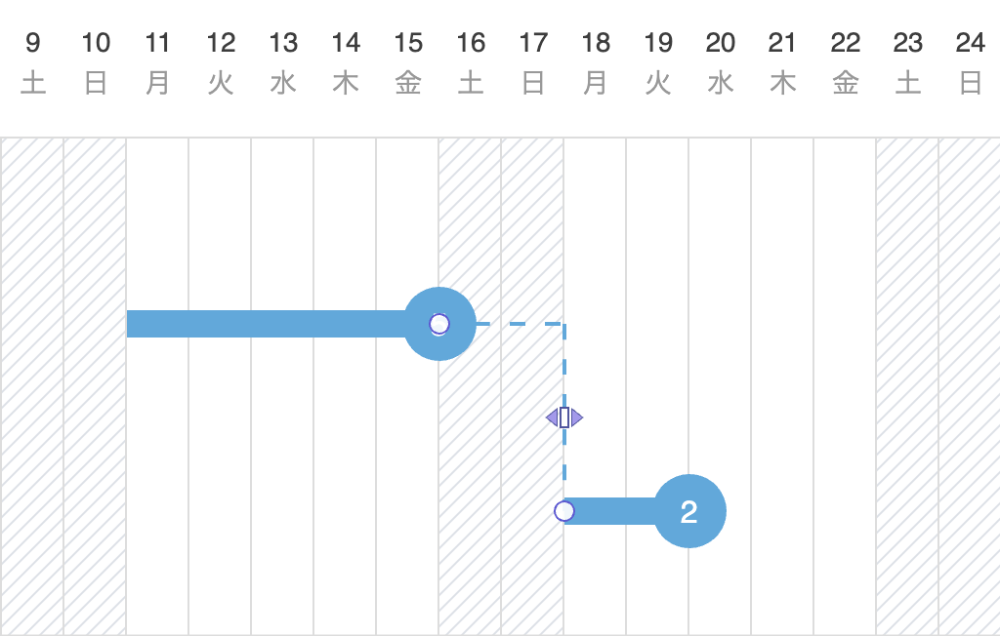

## 依存関係のタスクを強調表示する

画面上の要素が無いところで右クリック(iPad:タッチ&ホールド)し、コンテキストメニューから[依存関係のタスクを強調表示]、[非依存関係のタスクを透過表示]を選択します。いずれか、あるいは両方を適用することができます。

   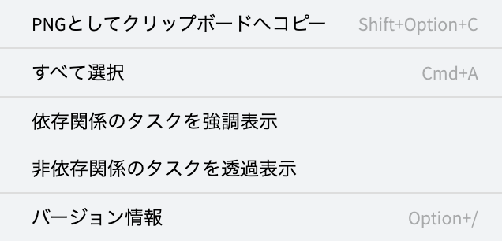

- [依存関係のタスクを強調表示]適用

   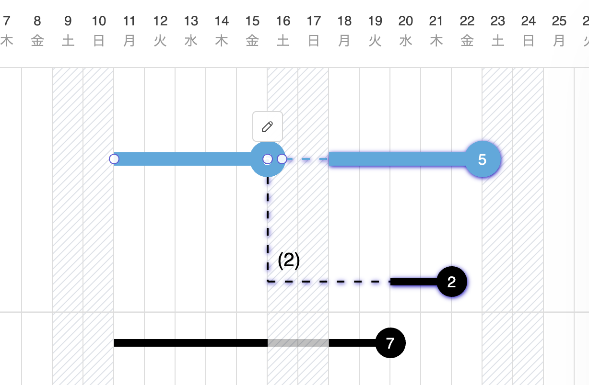

- [非依存関係のタスクを透過表示]適用

   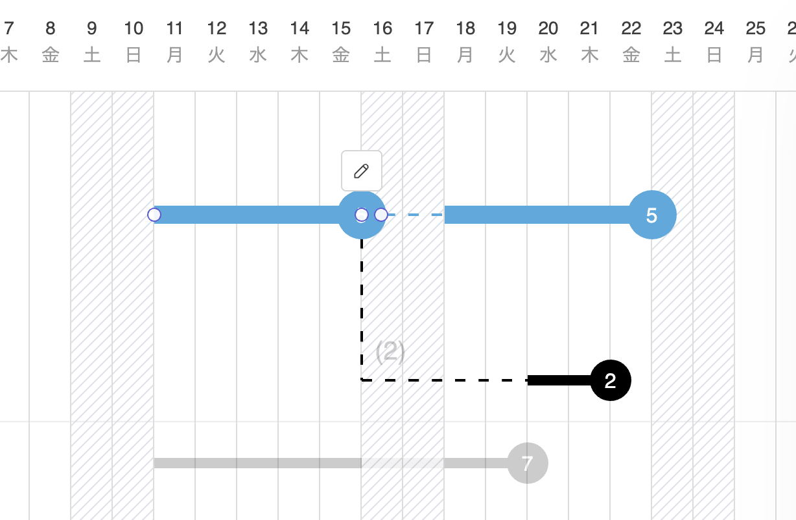

- [依存関係のタスクを強調表示]と[非依存関係のタスクを透過表示]適用

   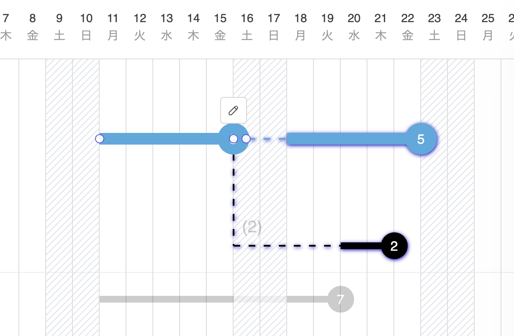

## ネットワーク線をロックする

1. ロックしたいネットワーク線の上にカーソルを移動します。
2. 右クリック(iPad:タッチ&ホールド)でコンテキストメニューを開き、[ロック]を選択します。

   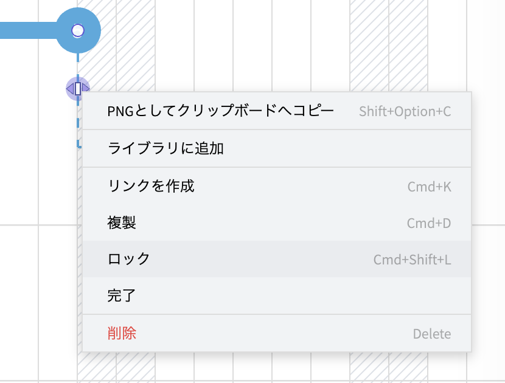

    ネットワーク線がロックされ、ロックアイコンが表示されます。
    
   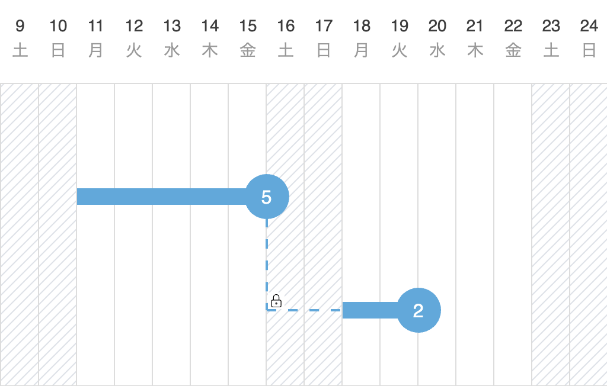

{: .note }
タスクの依存関係の中にロックされたネットワーク線がある場合、タスクの移動はロックされたネットワーク線の日数を保持したまま行われます。

## ネットワーク線のロックを解除する

1. ロックを解除したいタスクの上にカーソルを移動します。
2. 右クリック(iPad:タッチ&ホールド)でコンテキストメニューを開き、[ロック解除]を選択します。
    
   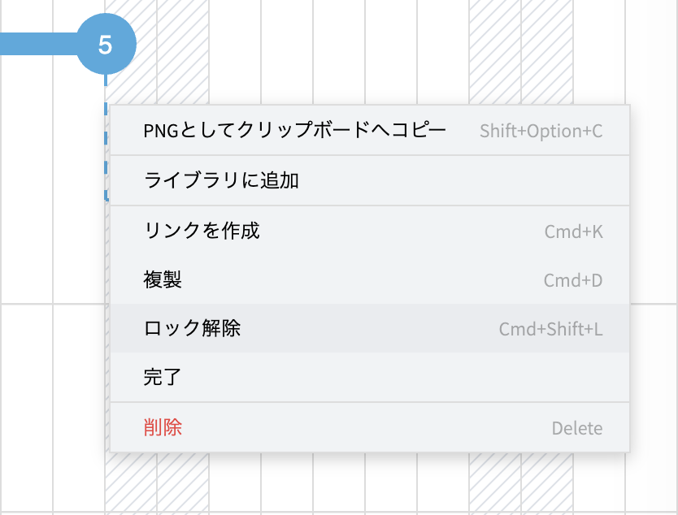

タスクのロックが解除されます。