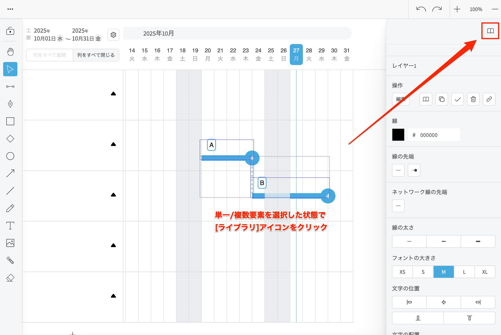

# ライブラリを使用する
{: .no_toc }

使用頻度の高いアイテムをライブラリに登録し、任意のタイミングでキャンバス上に貼り付けることができます。
ライブラリおよびライブラリのブックマーク状態は組織全体で共有されます。

## 目次
{: .no_toc .text-delta }

1. TOC
{:toc}

---

## 各部の名称

   

## ライブラリの登録

1. ツールバーの[選択]アイコンをクリックしてアクティブにします。

   

2. ライブラリに登録したい単一/複数要素を選択し、[ライブラリ]アイコンをクリックします。

   

3. ＋ボタンをクリックします。

   

4. ライブラリ名、カテゴリを入力して[登録する]ボタンをクリックします。

   

   ライブラリに登録されます。  

   

{: .note }
登録されたライブラリは、組織に自動的に共有されます。  
担当者を引き継ぐ、関連リソースを引き継ぐにチェックを入れると、担当者、関連リソースの情報もライブラリ呼び出し時に引き継ぐことができます。

## ライブラリの呼び出し

ライブラリのアイテムを描画したい領域にドラッグ＆ドロップします。

   

   

## ライブラリを編集する

1. ライブラリのアイテムをクリックします。

   

2. [...]のドロップダウンメニューから[編集]を選択します。

   

3. ライブラリ名、カテゴリを入力して[編集する]ボタンをクリックします。

   

## ライブラリを削除する

1. ライブラリのアイテムをクリックします。

   

2. [...]のドロップダウンメニューから[削除]を選択します。

   

3. [確定]ボタンをクリックします。

   

## ライブラリをブックマークする

ライブラリのアイテム右上の[ブックマーク]アイコンをクリックします。

ブックマークの状態が切り替わります。

{: .note }
ブックマークしたライブラリは優先表示されます。
