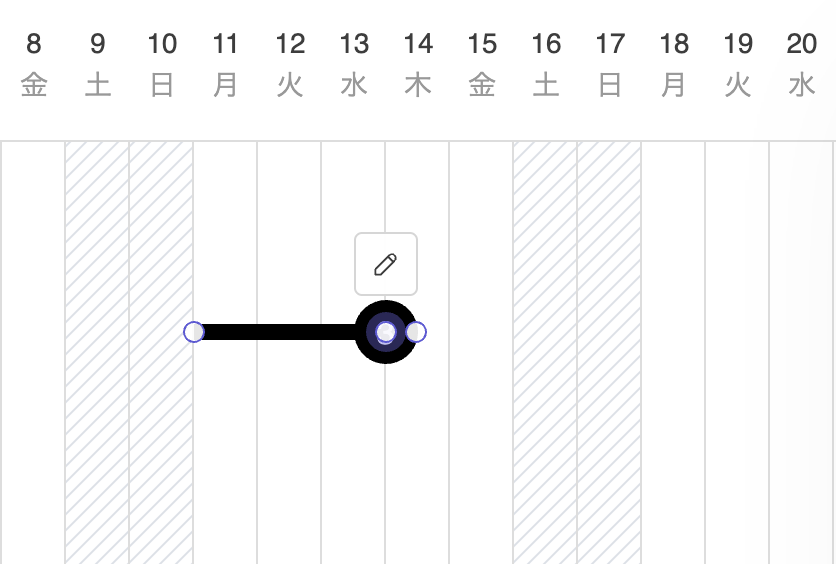
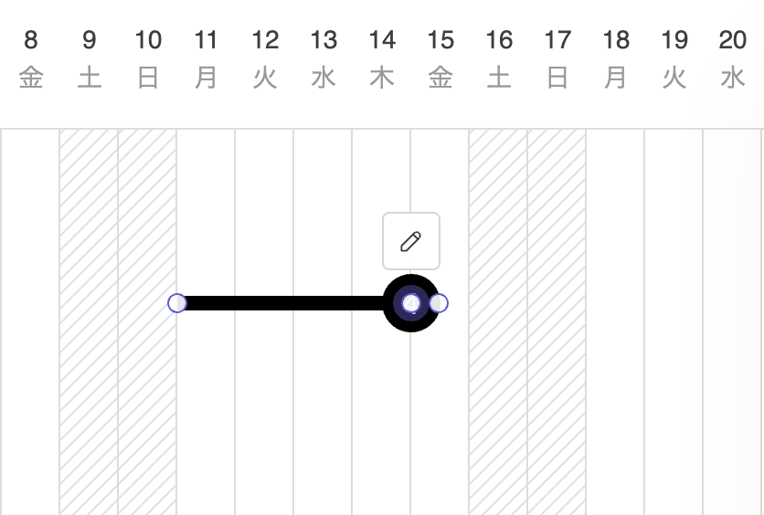

# タスクの期間を変更する

1. ツールバーの[選択]アイコンをクリックしてアクティブにします。

   

2. タスクをクリックして選択します。
3. タスク両端のいずれかのサークルをクリックします。

   

4. 左右方向にドラッグし、目的のポイントでドロップします。

   

{: .note }
依存関係にあるタスクの始点、終点を越えるタスクの期間変更を行うと以降のタスクも連動して移動します。    

{: .warning }
タスクの期間変更には次の制約があります。  
・1日未満への変更はできません  
・カレンダーの日付範囲外への変更はできません  
・依存関係にあるロックされたタスク、マイルストーンを越える変更はできません