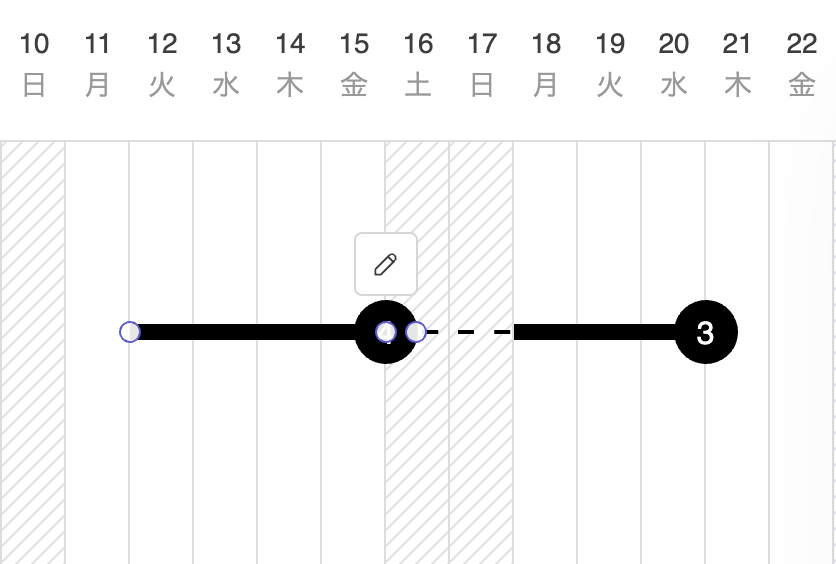
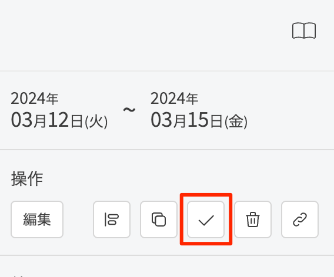
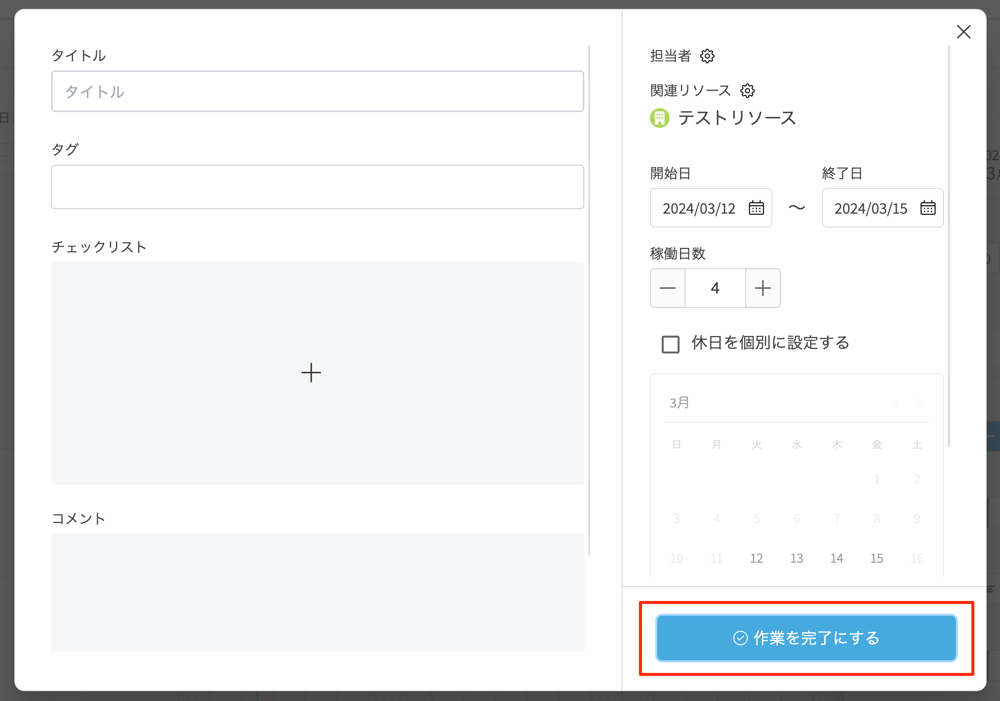
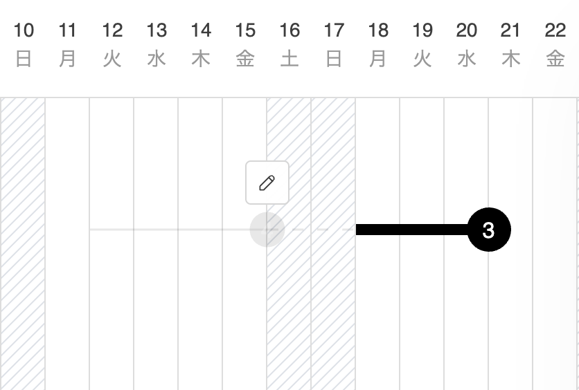

# タスクを完了済みにする

1. ツールバーの[選択]アイコンをクリックしてアクティブにします。

   <table><tr><td>
   
   </td></tr></table>

2. タスクをクリックして選択します。

   <table><tr><td>
   
   </td></tr></table>
    
3. 以下のいずれかの操作を行います。
    - サイドバーの操作から[完了]アイコンをクリックします。

   <table><tr><td>
   
   </td></tr></table>
    
    - タスク右上の[編集]アイコンをクリックし、[作業を完了にする]ボタンをクリックします。

   <table><tr><td>
   
   </td></tr></table>
    
    - 右クリック(iPad:タッチ&ホールド)でコンテキストメニューを開き、[完了]を選択します。
    
    タスク、それに付随する次のネットワーク線が完了表示になります。

   <table><tr><td>
   
   </td></tr></table>
