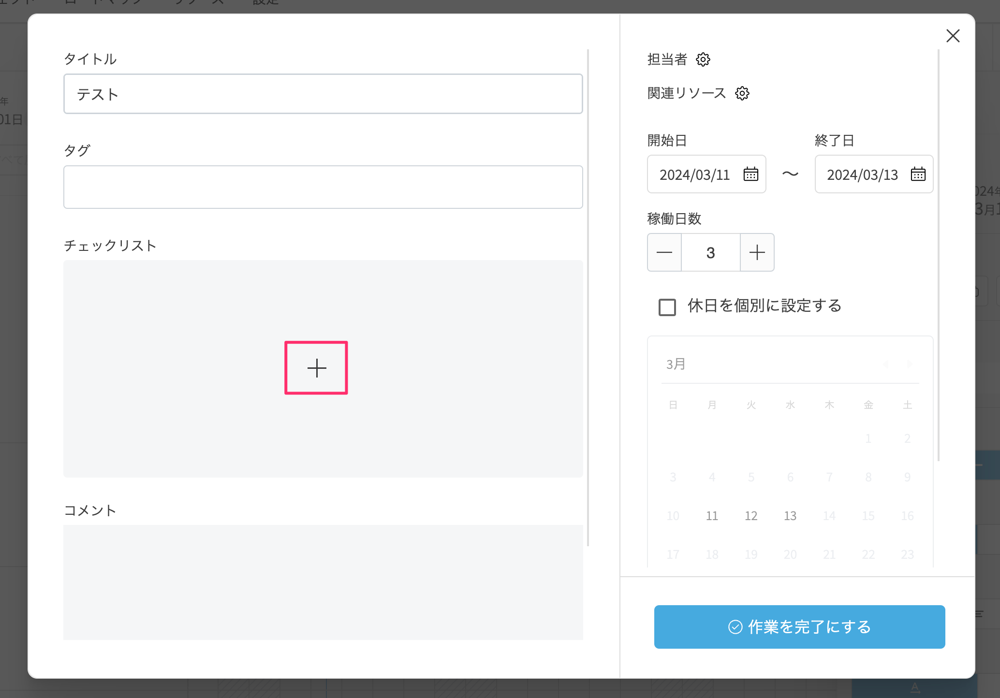

# チェックリストを追加する
{: .no_toc }

## 目次
{: .no_toc .text-delta }

1. TOC
{:toc}

---

## チェックリストを追加する

1. ツールバーの[選択]アイコンをクリックしてアクティブにします。

   

2. タスクをクリックして選択します。
3. 以下のいずれかの操作を行います。
    - サイドバーの操作から[編集]ボタンをクリックします。    
    - タスク右上の[編集]アイコンをクリックします。
    - 右クリック(iPad:タッチ&ホールド)でコンテキストメニューを開き、[編集]を選択します。

4. チェックリスト欄の[+]アイコンをクリックします。

   

5. チェックリストのテキストを入力します。

   

{: .note }
チェックリストにはURLを任意で登録することができます。URLをクリックすると外部のページが開かれます。

## チェックリストのチェック状態を更新する

1. ツールバーの[選択]アイコンをクリックしてアクティブにします。

   
    
2. タスクをクリックして選択します。
3. 以下のいずれかの操作を行います。
    - サイドバーの操作から[編集]ボタンをクリックします。
    - タスク右上の[編集]アイコンをクリックします。
    - 右クリック(iPad:タッチ&ホールド)でコンテキストメニューを開き、[編集]を選択します。

4. チェックリスト一覧のチェックボックスをクリックします。

   

## チェックリストを削除する

1. ツールバーの[選択]アイコンをクリックしてアクティブにします。

   

2. タスクをクリックして選択します。
3. 以下のいずれかの操作を行います。
    - サイドバーの操作から[編集]ボタンをクリックします。
    - タスク右上の[編集]アイコンをクリックします。
    - 右クリック(iPad:タッチ&ホールド)でコンテキストメニューを開き、[編集]を選択します。

4. チェックリスト一覧の[...]のドロップダウンメニューから[削除]を選択します。

   
