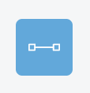

# タスクを作成する

1. ツールバーの[タスク]アイコンをクリックしてアクティブにします。

   

2. キャンバスの描画したい領域をクリックしたままにします。
   
   

3. 右方向にドラッグし、目的のポイントでドロップします。  
   タスクの終点に稼働日数が表記されます。
   
   

4. タイトルを入力し、EscキーまたはCmd + Enterキーを押して編集を終了します。
   
   
   
   ツールバーの[ロック]がアクティブの場合、タイトルの入力がスキップされ、連続でタスクを作成することができます。
   
   
   

{: .note }
クリティカルパス（依存関係にあるタスクを含むキャンバス内で最も長い経路）は自動的に水色になります。クリティカルパスの色は[設定>一般](#クリティカルパスの色を変更する)から変更できます。