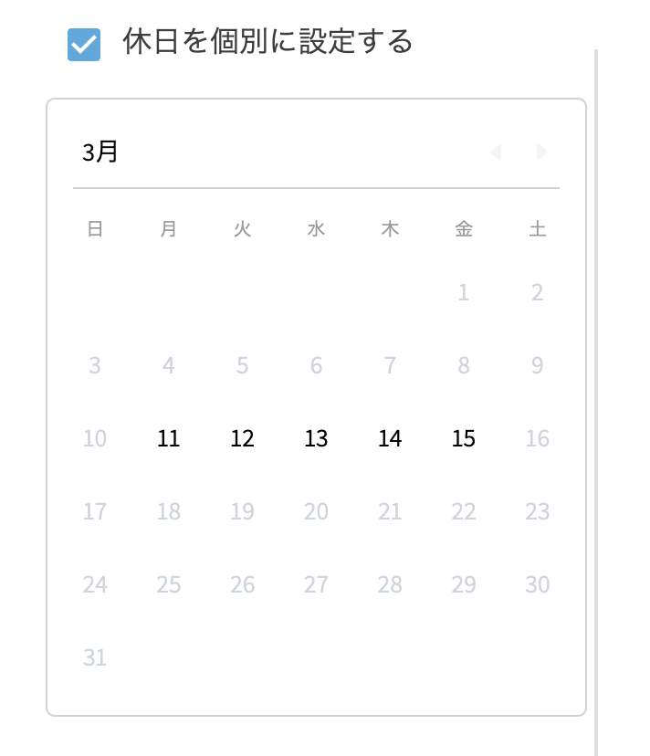
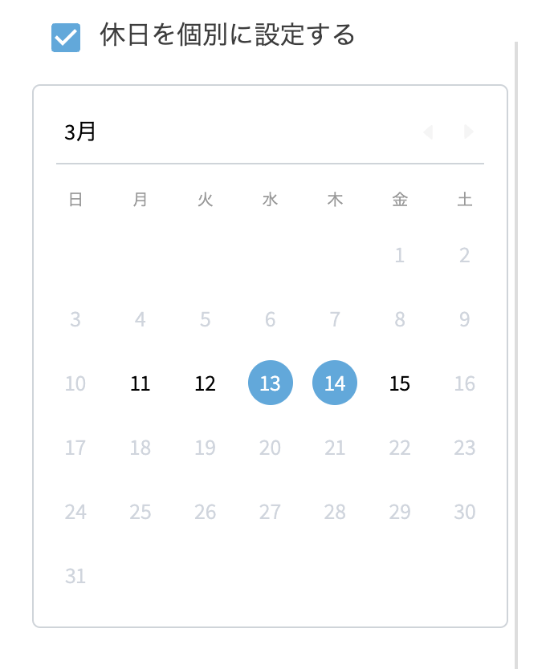
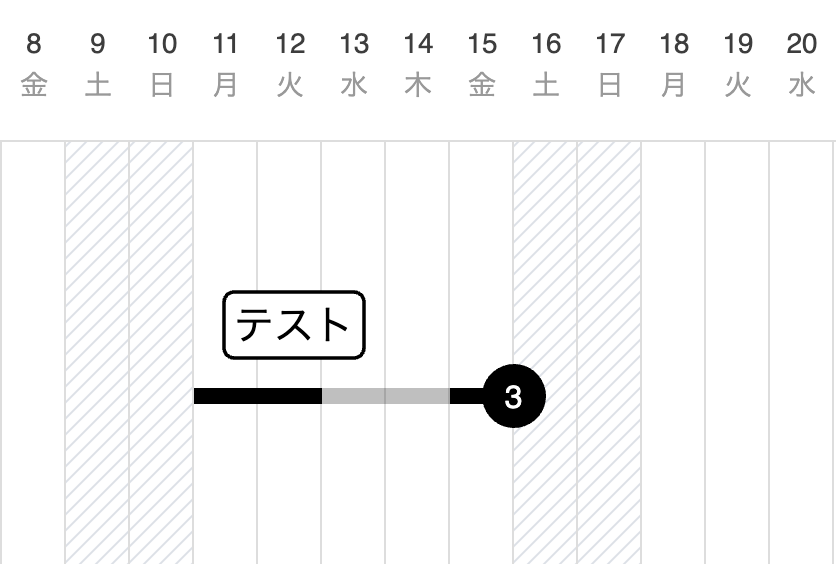

# 個別休日を設定する

1. ツールバーの[選択]アイコンをクリックしてアクティブにします。

   <table><tr><td>
   
   </td></tr></table>

2. タスクをクリックして選択します。
3. 以下のいずれかの操作を行います。
    - サイドバーの操作から[編集]ボタンをクリックします。
    - タスク右上の[編集]アイコンをクリックします。
    - 右クリック(iPad:タッチ&ホールド)でコンテキストメニューを開き、[編集]を選択します。

4. [休日を個別に設定する]にチェックを入れます。

   <table><tr><td>
   
   </td></tr></table>
    
5. 表示されたカレンダー内で休日を選択し、[×]アイコンをクリックして編集画面を閉じます。

   <table><tr><td>
   
   </td></tr></table>
    
    タスクに個別休日が反映されます。

   <table><tr><td>
   
   </td></tr></table>

{: .warning }
個別休日の計算には以下が適応されます。  
・個別休日は設定したタスクにのみ適応されます  
・プロジェクト全体の休日を当該タスクで稼働日とすることが可能です  
・[休日を個別に設定する]のチェックを外すと個別休日はリセットされ、全体休日が反映されます
