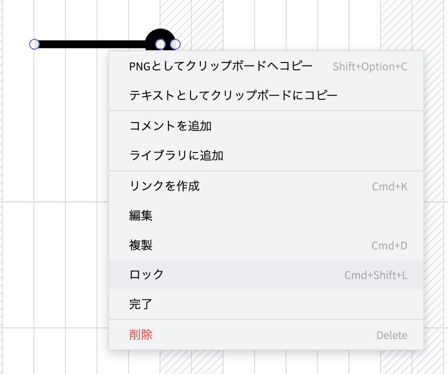
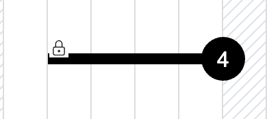

# タスクをロックする

1. ロックしたいタスクの上にカーソルを移動します。
2. 右クリック(iPad:タッチ&ホールド)でコンテキストメニューを開き、[ロック]を選択します。

   

    タスクがロックされ、タスクの左上にロックアイコンが表示されます。

   
    
{: .warning }
ロックされたタスクはコンテキストメニューの[編集]以外での移動ができなくなります。タスクの依存関係の中にロックされたタスクがある場合、他のタスクの移動はロックされたタスクまでに制限されます。
