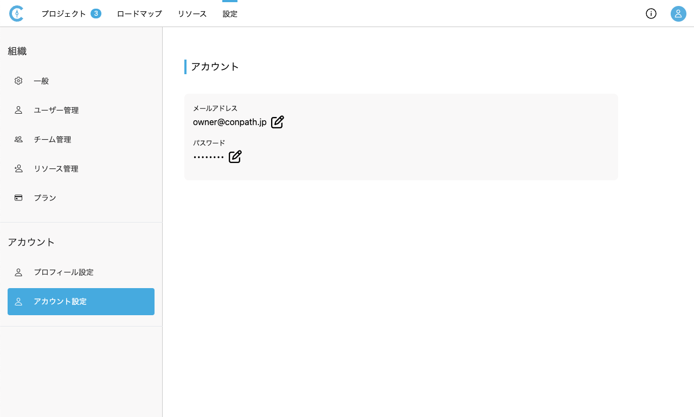

# アカウント設定
{: .no_toc }

アカウント設定では、ログインしているユーザー個人のアカウントに関する設定を行うことができます。

## 目次
{: .no_toc .text-delta }

1. TOC
{:toc}

---

## メールアドレスを変更する

1. [設定>アカウント設定]を開きます。

   <table><tr><td>
   
   </td></tr></table>

2. メールアドレス欄の[編集]アイコンをクリックします。
3. 新しいメールアドレスを入力し、更新をクリックします。

   <table><tr><td>
   
   </td></tr></table>

4. 更新したメールアドレスにメールが届くので、メールの内容に従って進めてください。

## パスワードを変更する

1. [設定>アカウント設定]を開きます。

   <table><tr><td>
   
   </td></tr></table>

2. パスワード欄の[編集]アイコンをクリックします。
3. 現在のパスワード、新しいパスワードを入力し、更新をクリックします。

   <table><tr><td>
   
   </td></tr></table>