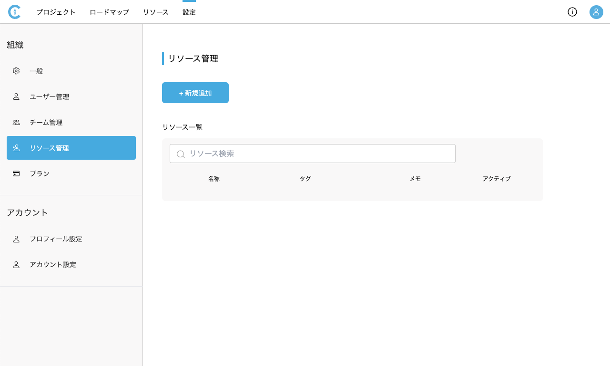

# リソース管理
{: .no_toc }

リソース管理では、リソースの登録、編集を行うことができます。  
リソースは人や機械など汎用的に登録でき、[タスクに関連付け]()ることで[リソース]()で関連リソース毎にグループ化されるようになります。

## 目次
{: .no_toc .text-delta }

1. TOC
{:toc}

---

## リソースを新規追加する

1. [設定>リソース管理]を開きます。

   <table><tr><td>
   
   </td></tr></table>

2. [新規追加]ボタンをクリックします。

   <table><tr><td>
   
   </td></tr></table>

3. リソースの情報を入力し、[登録]ボタンをクリックします。

   <table><tr><td>
   
   </td></tr></table>

{: .note }
この設定は組織の権限がオーナーのみ可能です。

## リソースを編集する

1. [設定>リソース管理]を開きます。
2. リソース一覧のリソースの[...]のドロップダウンメニューから[編集する]をクリックします。

   <table><tr><td>
   
   </td></tr></table>

3. リソースの情報を入力し、[変更]ボタンをクリックします。

{: .note }
この設定は組織の権限がオーナーのみ可能です。

## リソースを削除する

1. [設定>リソース管理]を開きます。
2. リソース一覧のリソースの[...]のドロップダウンメニューから[削除する]をクリックします。

   <table><tr><td>
   
   </td></tr></table>

3. [削除する]をクリックします。

{: .note }
この設定は組織の権限がオーナーのみ可能です。

## リソースを非アクティブにする

1. [設定>リソース管理]を開きます。
2. リソース一覧のリソースのアクティブ列の[チェックボックス]をクリックし、チェックを外します。

   <table><tr><td>
   
   </td></tr></table>

{: .note }
非アクティブの場合、タスクの関連リソースの選択候補に表示されなくなります。  
この設定は組織の権限がオーナーのみ可能です。