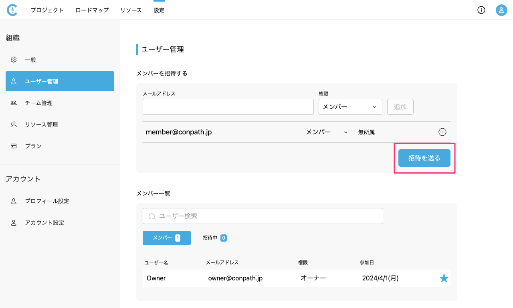
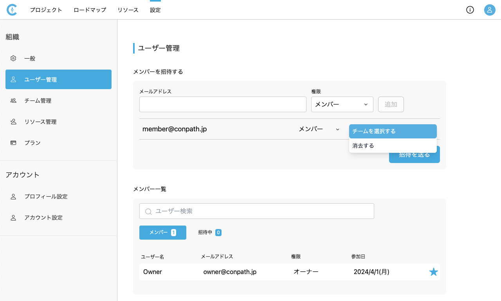

# ユーザー管理
{: .no_toc }

ユーザー管理では、組織にメンバーを招待したり、メンバーの状態を一覧で確認したりすることができます。

## 目次
{: .no_toc .text-delta }

1. TOC
{:toc}

---

## メンバーを招待する

1. [設定>ユーザー管理]を開きます。

   <table><tr><td>
   
   </td></tr></table>

2. 招待したいユーザーのメールアドレスと権限を選択し、[追加]ボタンをクリックします。

   <table><tr><td>
   
   </td></tr></table>

3. 招待したいユーザーを追加後、[招待を送る]ボタンをクリックします。

   <table><tr><td>
   
   </td></tr></table>

4. 追加したメールアドレス宛に招待メールが届きます。

{: .note }
この設定は組織の権限がオーナーのみ可能です。

## メンバーのユーザー情報を変更する

1. [設定>ユーザー管理]を開きます。
2. メンバー一覧のメンバータブがアクティブになっている状態で、[...]のドロップダウンメニューから[ユーザー情報の編集]をクリックします。

   <table><tr><td>
   
   </td></tr></table>

3. ユーザーの情報を入力し、[変更する]ボタンをクリックします。

   <table><tr><td>
   
   </td></tr></table>

{: .note }
この設定は組織の権限がオーナーのみ可能です。

## メンバーの招待をキャンセルする

1. [設定>ユーザー管理]を開きます。
2. メンバー一覧の招待中タブがアクティブになっている状態で、[...]のドロップダウンメニューから[招待をキャンセルする]をクリックします。

   <table><tr><td>
   
   </td></tr></table>

{: .note }
この設定は組織の権限がオーナーのみ可能です。

## メンバーを退会させる

1. [設定>ユーザー管理]を開きます。
2. メンバー一覧のメンバータブがアクティブになっている状態で、[...]のドロップダウンメニューから[退会させる]をクリックします。

   <table><tr><td>
   
   </td></tr></table>

{: .note }
この設定は組織の権限がオーナーのみ可能です。